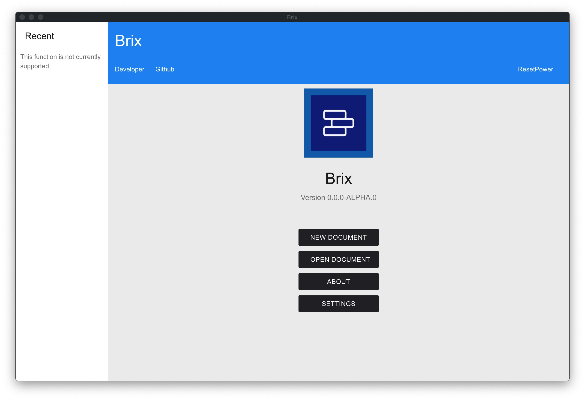

# Brix

> Edit documents conveniently and add multimedia elements.

[简体中文](README.md) | English

You can use Brix to write a document. Add custom components or defined components to enrich your documents.
Used to display rich content beyond a single text, write, design and share your content.
The brp file using json as the original format (full name Brix Project) is a file format similar to Markdown, but it is not lightweight and easy to use (for now).

## Background

It is the original intention of this project to make light document editing and simple scripting more convenient. At the same time, we hope to integrate content similar to Office Family Bucket and provide functions that facilitate document writing, design and sharing.

## Attention

This project is under preparation and most of the functions cannot be realized.

## Features

- No content yet

## Screenshots

### Home

### About

### Document creation

### Document editing

## Guide to Use

This project is developed using [node](nodejs.org) and [npm](npmjs.org).

- Install node.js on your computer and use the following command to install electron globally:
     `npm install electron -g`
- Enter `npm start` after entering the project directory to start Brix

- Or use the archive package in Releases to install and start

## Brief description of project directory structure
<!-- js文件是作为相关源文件还是脚本作用的呢？不应当采用js的名称，可能采用src或者script更好，这一点可以讨论-->

- assets/ : Resource files that need to be used in the project or documents in the project
- css/ : CSS files used by HTML files in the project
- js/ : JavaScript files used by HTML files in the project
- muicss/ : The project references the muicss library, in order to load quickly, put muicss into the project

## Changelog
<!-- changelog 建议采用单独文件，可以参考我写的有关自动化changelog的github action以及其结果，单独的changelog文件相对规范而清晰一些-->
### Snapshot 20w31a

- The first version of the application

## Future Planning (For v0.0.0-alpha.0)

- List of implementation components
- Realize login/register

## Contributing
<!--这一部分需要等补充完善了code_of_conduct和contributing之后在加以完善-->
- No contents yet

### Contributor

- [ResetPower](https://github.com/ResetPower)
- [BobAnkh](https://github.com/BobAnkh)
- [ICE-Flowey](https://github.com/ICE-Flowey) （Has left）

## License

- Apache 2.0 LICENSE
