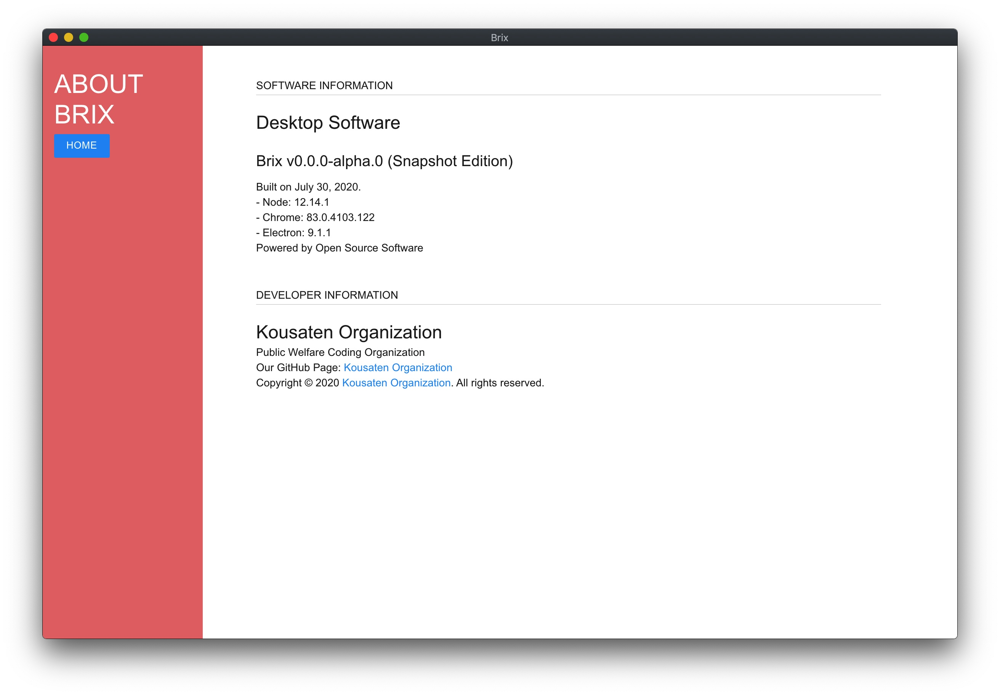

# Brix

> 便利地编辑文档，并添加图片、视频等多媒体元素

简体中文 | [English](README.en.md)

## 项目简介

Brix是一个使用Electron框架，以HTML+CSS+JS为主的编程语言编写的，用于创建、设计、编辑和分享丰富的多媒体文档的应用程序

目前，Brix正处于开发的初始阶段，各项功能都非常不成熟，需要各位大佬的帮助

Brix目前最新的快照版本为20w31a，但功能近乎残废，可以等待近期即将发布的 v0.0.0-alpha.0

所有版本的Brix均可在release中下载安装

## 特性与未来规划

| 特性 | 是否完成 |
| --- | --- |
| 文档基础组件添加与编辑 | ✅ |
| 账户登录与注册 | ✅ |
| 文档单独预览页 | ❌ |
| 文档加入图片与视频等多媒体元素 | ❌ |
| 多语言支持 | ❌ |
| 主题自定义 | ❌ |
| 登录后云同步文档 | ❌ |

- 仍有更多未展出

## 如何安装并使用

- 你可以选择参照下列方法或者使用Releases中的归档包安装并启动

本项目使用 [node](nodejs.org) 与 [npm](npmjs.org) 开发。

- 从Node.js官网下载并在你的电脑上安装Node.js，使用以下命令来全局安装electron：
    `npm install electron -g`
- 打开终端，使用cd命令进入项目目录
- 输入`npm start`来启动Brix

## 使用教程

参照我们的 [官方文档](https://kousaten.github.io/brix/) 来获取一些基础的使用指南。

## 使用截图

### 首页

### 关于

### 文档创建

### 文档编辑

## 项目目录结构简述

- assets/ : 项目或项目中的文档等需要使用到的资源文件
- css/ : 项目中HTML文件需要使用到的CSS文件
- js/ : 项目中HTML文件需要使用到的JavaScript文件
- muicss/ : 项目引用了muicss库，为了快速加载，将muicss的输出文件单独放入该文件夹中

## 如何贡献

- 参考 [CONTRIBUTING.md](https://github.com/BobAnkh/LinuxBeginner/blob/master/CONTRIBUTING.md)

### 贡献者

- [ResetPower](https://github.com/ResetPower)
- [BobAnkh](https://github.com/BobAnkh)

## 使用许可

- Apache 2.0 LICENSE
