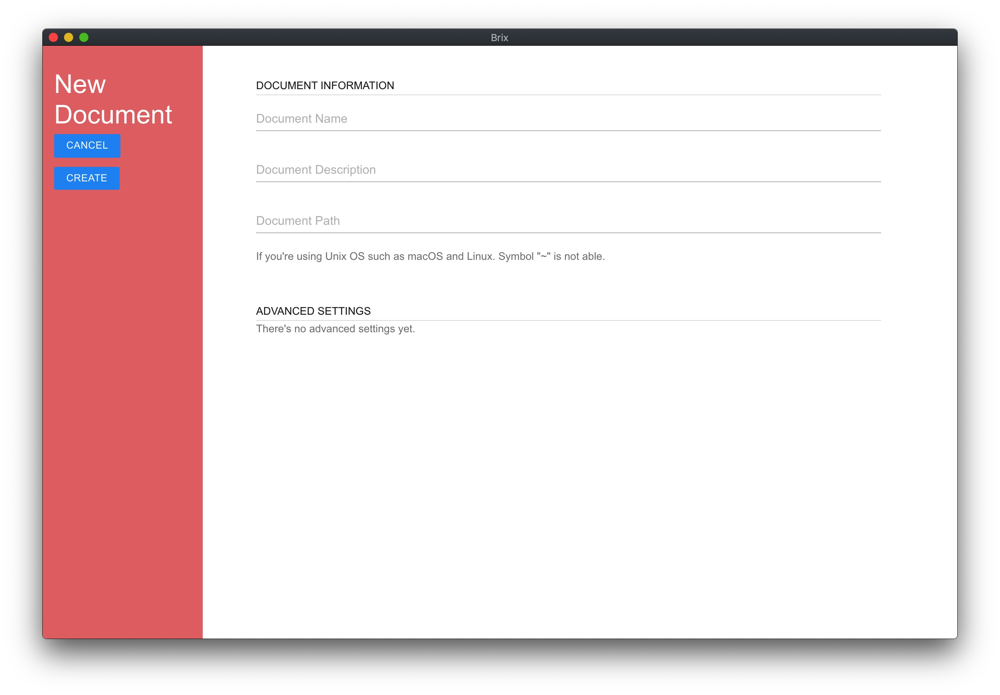
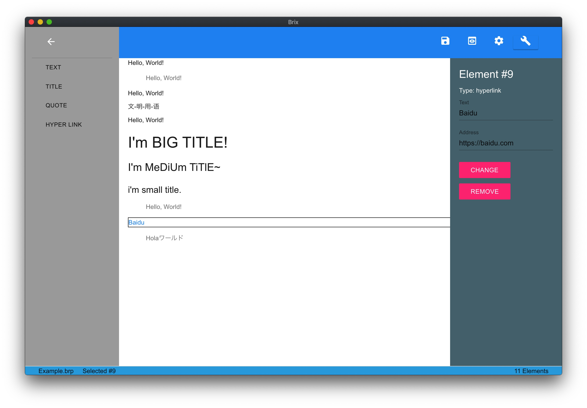

# Brix

> 便利地编辑文档，并添加图片、视频等多媒体元素

简体中文 | [English](README.en.md)

你可以使用Brix编写一个文档。添加自定义的组件或已定义的组件，使你的文档更加丰富
用于展示超出单个文本的丰富内容，编写、设计和分享你的内容
使用json为原格式的brp文件(全称 Brix Project)是一种类似Markdown的文件格式，但并不轻量级也不好用(目前来说)

## 背景

让轻度文档编辑和简单的脚本程序编写更加方便是本项目的初衷，同时我们希望整合类似Office全家桶的内容，提供方便文档编写、设计和分享的功能

## 注意

本项目正在编写中，大部分功能无法实现

## 功能介绍

- 暂无内容

## 使用说明

本项目使用 [node](https://nodejs.org/en/) 与 [npm](https://www.npmjs.com/) 开发

- 在你的电脑上安装node.js并使用`npm install electron -g`命令来全局安装electron
- 进入项目目录后输入`npm start`来启动Brix
- 或者使用Releases中的归档包安装并启动

## 图片展示

### 首页

### 关于

### 新建文档

### 文档编辑

## 项目目录结构简述
<!-- js文件是作为相关源文件还是脚本作用的呢？不应当采用js的名称，可能采用src或者script更好，这一点可以讨论-->

- assets/ : 项目或项目中的文档等需要使用到的资源文件
- css/ : 项目中HTML文件需要使用到的CSS文件
- js/ : 项目中HTML文件需要使用到的JavaScript文件
- muicss/ : 项目引用了muicss库，为了快速加载，将muicss放入项目中

## 更新日志
<!-- changelog 建议采用单独文件，可以参考我写的有关自动化changelog的github action以及其结果，单独的changelog文件相对规范而清晰一些-->
### Snapshot 20w31a

- 本软件的第一个版本

## 将来规划 (For v0.0.0-alpha.0)

- 实现组件列表
- 实现登录/注册

## 如何贡献
<!--这一部分需要等补充完善了code_of_conduct和contributing之后在加以完善-->
- 暂无内容

### 贡献者

- [ResetPower](https://github.com/ResetPower)
- [BobAnkh](https://github.com/BobAnkh)
- [ICE-Flowey](https://github.com/ICE-Flowey) （已离开）

## 使用许可

[Apache-2.0](LICENSE)
